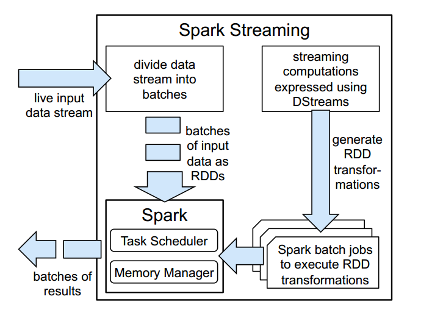
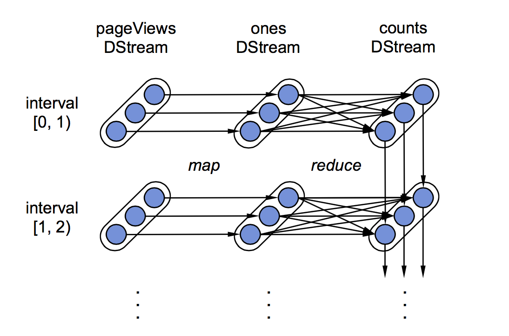
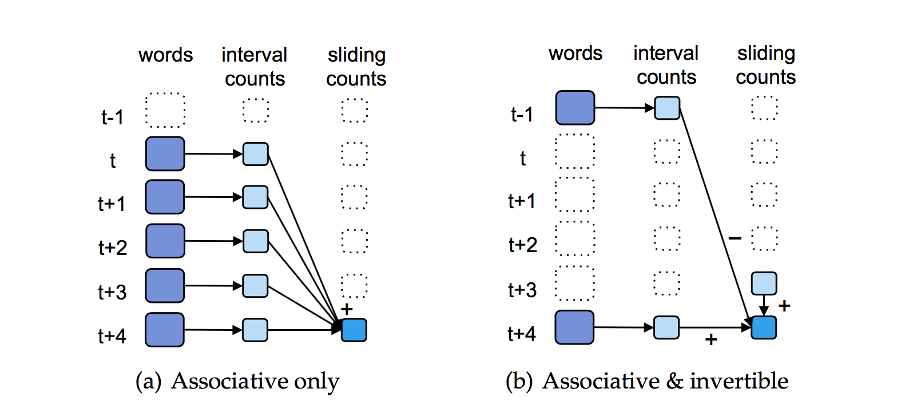
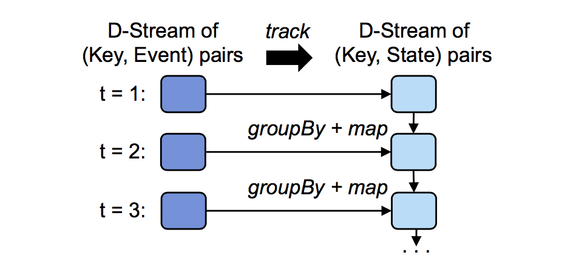

>`D-Streams`通过将计算构造为一组*短的*，*无状态的*，*确定性的*任务代替连续的、有状态的操作来避免传统流处理的问题。然后通过容错的数据结构（`RDD`）来将状态保持在内存中，用于重新计算状态。
将计算分解成短任务并暴露其细粒度的依赖性并允许像并行恢复和推测（`speculate`）这样强大的恢复技术。除了容错，`D-Stream`还模型提供了其他好处，比如与批处理相结合。



图4.2是`Spark`流系统的高级概述。`Spark Streaming` 把输入数据流分成批，并将它们存储在`Spark` 内存中，然后生成`Spark`作业来处理每个批次数据。

# 计算模型

我们把流计算看作在一小段时间范围内的一系列确定性的批计算。对于每个时间范围的数据，在集群中存储成一个可靠的数据集。一旦时间范围的数据准备好，这些数据可以通过确定的并行操作，如`map`、`reduce`、`group by`，去
产生新的数据集，这个新的数据集表示输出数据或者中间状态。对于前面的情况，结果可以以分布式的方式推送到一个外部系统。在后面的情况中，中间状态可以通过弹性分布式数据集（RDDs）的高效的存储，
这样可以避免使用`lineage`进行恢复而产生的冗余。该状态数据集可以与下一批输入数据一起处理，以产生一个新的数据集来更新中间状态。图 4.1.b展示了我们的模型。

我们基于这样的模型实现了我们的系统-`spark streaming`，我们用`spark`作为我们的批处理引擎处理每一批数据。 图4.2大致描绘了 Spark Streaming 上下文中的计算模型，后续我们会作更详细的解释。

在我们的API中，用户通过操作我们称之为离散流（`D-Streams`）的对象来定义程序。一个`D-Streams`是一个可变的、分区的数据集（`RDD`）的序列，我们可以通过确定的转换对它进行操作。这些转换可以得到一个
新的`D-Streams`，并可以以RDD的形式创建中间状态。

我们通过一个计算URL访问次数的spark streaming程序来证明我们的想法。。类似于`LINQ`【115,3】，`Spark Streaming`通过Scala语言的可编程的API暴露`D-Streams`。我们的程序代码如下所示：

```scala
pageViews = readStream("http://...", "1s")
ones = pageViews.map(event => (event.url, 1))
counts = ones.runningReduce((a, b) => a + b)
```



图4.3展示了`view count`程序里 RDDs的`lineage`。每个椭圆代表一个 RDD，分区用圆圈表示。每个RDDs的序列是一个`D-Stream`。

这段代码通过`HTTP`读取一个事件流并将它们以一秒的时间间隔来分组，创建一个名叫*pageViews*的`D-Streams`。然后将这个事件流转换为一个通过`（URL，1）`键值对表示的新的`D-Stream`，最后
通过一个状态相关的`runningReduce`转换来对他们进行计数操作。传入`map`和`runningReduce`的参数是`Scala`的函数字面量。

为了执行这个程序，`Spark Streaming`接收数据流，然后将其划分成秒级的批数据，存储在`Spark`的`RDDs` 内存中（见图 4.2）。同时，他也会调用RDD的转换操作如`map`和`reduce`来对RDD进行处理。
为了执行这些转换，`Spark`首先会启动`map`任务来对这些事件进行处理，以生成`(url,1)`计数对。然后，它会启动reduce任务处理`map`的结果以及之前时间间隔内`reduce`操作得到的结果，将最后结果存储在RDD中。
这些任务会产生一个更新计数的新RDD。程序中的每个`D-Stream`因此变成了一组RDD序列。

最后，为了恢复错误和慢任务，`D-Streams`和RDDs要跟踪他们的`lineage`，即用于生成他们的确定性的操作图。在每一个分布式数据集中，Spark会在分区的层面跟踪这些信息，如图4.3所示。
如果一个节点任务失败，它会通过重新运行构建它们的任务来计算相应的RDD分区。这个系统还周期性的`Checkpoint` RDD的状态（例如通过异步的方式对每十个RDD进行复制）以避免大量的重算。
但是不需要对所有数据都进行那样的操作，因为恢复总是很快：丢失的分区可以在不同的节点上并行计算。同理，当一个节点运行缓慢时，因为总会产生同样的结果，我们可以在其他节点上对任务的副本进行推测执行【36】。

我们发现在`D-Streams`中并行恢复比在向上备份中具有更高的可用性，即使每个节点上执行了多个操作。`D-Streams`在分区和时间上都展示了并行性。

- 1 和每个节点执行多个任务的批处理系统非常相似，每个节点在一个转换的每个时间段都可能产生多个RDD分区（例如100核的集群产生1000个RDD分区）。当节点出现故障时，我们可以在其它节点以并行方式重新计算该分区。
- 2 lineage 图通常可以使数据从不同的时间片并行地进行重建。如图4.3所示，如果一个节点出错，我们可能丢失一些时间片的map的输出，这些时间片的map任务可以并行的重新执行。在一个连续处理的系统中是无法实现这样的功能。

依赖这些特性，当每30秒建立一次检查点时，`D-Streams`仅用1-2秒就可以在数百个核上并行恢复。

我们将在本节的剩余部分更详细地介绍`D-Streams`的可靠性和编程接口。并在4.4.节中讨论如何实现。

# 时序性考虑

注意，`D-Streams`按每个记录到达系统的时间存入输入数据集。这样做可以确保系统总是可以及时开始一个新的批次，尤其是在那些记录从相同的地方里产生的应用中，例如同一个数据中心的服务产生的数据，以
这样的方式分割处理，在语义上不会产生错误。而在其他应用中，开发者可能希望基于事件发生的外部时间戳将记录分组，例如，基于用户点击某一个链接的时间，而这样的数据可能是无序的。`D-Streams`提供了两种方法来处理这种情况：

- 1 系统可以在开始处理每个批数据时等待一个有限的"空闲时间"；
- 2 用户程序可以在应用级上对晚到的记录进行修正。例如，假设一个应用希望统计时间t到时间t+1的广告点击数。利用以1秒为时间间隔数的`D-Streams`，一旦t+1时刻过去，应用就可以对t时刻与t+1时刻之间接收的点击数进行统计。
然后在以后的时间间隔内，应用可以进一步收集外部时间戳为t到t+1的事件，并更新结果。例如，它可能将基于从t到t+5时间段内收到的记录，在t+5时刻产生一个在[t, t + 1)时间区间的新的计数。这种计算可以用一种有效的增量`reduce`操作
来执行，它会在t+1时刻的计数基础上加上对之后新记录的计数，以避免重复计算。此方法类似于顺序无关处理【67】。

时序性的考虑是流式处理系统所必须面对的，因为任何系统都必须处理外部延时。在数据库领域已经对此进行了详细的研究【67，99】。一般来说，这些技术都可以通过`D-Streams`来实现，即将计算”离散化“到小批次数据来计算（相同批次的处理逻辑相同）。
因此我们不会在本文中对这些方法做进一步的探讨。

# D-Stream API

因为`D-Stream`是主要的实现策略（描述如何将一个计算分解成多个步骤），因此他们可以实现流式系统中多个标准的操作，例如滑动窗口和增量处理【29，15】，通过将他们的操作分批到一个小的时间步中。为了说明这一过程，我们描述了在`Spark Streaming`中的操作，虽然其它接口（如SQL）也会支持。

在`Spark Streaming`中，用户用函数式API注册一个和多个流。程序可以将外部系统读入的数据视为输入流，他通过对节点端口监听或者周期性地从一个存储系统(例如`HDFS`）加载来获取数据。对这些流可以应用两种类型的操作。

- 转换（`Transformations`）操作，从一个或多个父数据流创建一个新的`D-Stream`。这些操作可能是无状态的，对每个时间周期内的RDD分别进行处理，或它们可能跨越周期来产生状态。
- 输出操作，程序可以通过他们写数据到外部系统。例如`Save`操作可以将`D-stream`中的所有RDD存储到数据库中。

`D-Stream`支持典型的流处理框架【36，115】中支持无状态转换操作，包括`map`，`reduce`，`groupBy`以及`join`。我们支持`Spark`中的所有操作。例如，一个程序可以通过下面的代码，
在`D-Stream`的每一个时间周期内，实现一个规范的`MapReduce word count`功能。

```scala
pairs = words.map(w => (w, 1))
counts = pairs.reduceByKey((a, b) => a + b)
```

另外，`D-stream`支持几种有状态的转换操作，用以处理跨多个时间段的计算，这些操作基于标准的数据流处理技术，如滑动窗口【29，15】。这些操作包括三类。




图4.4描述关联版本以及关联+可逆版本的操作执行`reduceByWindow`。这两个版本都只会对每个时间段计算一次，但是第二个版本避免了对每一个窗口进行重新求和。方框表示RDDs，箭头表示用来计算窗口[t,i + 5)的操作。

**窗口**：`window`操作将过去时间周期的滑动窗口里的所有记录组合到一个RDD。例如，调用代码`words.window("5s")`，会产生一个`D-Stream`，它的RDD包含[0,5),[1,6),[2,7)等时间间隔的单词。

**增量聚合**：对于常用的聚合计算的用例，如`count`或`max`操作，在滑动窗口上，`D-Streams`有增量`reduceByWindow`操作的几个变种操作。最简单的一个是仅仅用一个关联的`merge`函数来对值进行合并。例如，你可以写如下代码来实现：

```scala
pairs.reduceByWindow("5s", (a, b) => a + b)
```

每一个时间周期只对该周期的计数进行一次计算，但需要重复地对过去的5秒去增加计数，如图4.4(a)所示。如果聚合函数也是可逆的,一个更加高效的版本还持有一个用以“减”值和维护状态递增的函数，如图 4.4(b):

```scala
pairs.reduceByWindow("5s", (a,b) => a+b, (a,b) => a-b)
```

**状态跟踪**：通常，应用程序需要对状态改变事件的响应流的各类对象进行状态跟踪。例如，一个监控在线视频传输的程序可能会希望对活跃会话（`session`）的数量进行追踪，一个会话表示从系统收到一个新客户端的`join`事件和当它收到`exit`的间隔时间。
然后，它会提出这样的问题：“有多少个比特率大于 X 的会话”。

`D-Streams`提供了一个转换数据流的操作`updateStateByKey`，它将`(Key, Event)`记录的流转换成`(Key, State)`记录的流。这个方法有三个参数：

- 一个初始化函数，它用于从第一个事件中为新的key创建一个状态
- 一个更新函数，它用于从给定的一个旧状态和一个相应键的事件返回一个新的状态值
- 一个用于删除旧的状态的`timeout`时间

例如，用户可以从一个`(ClientID, Event)`对的数据流中计算活跃的会话数，代码如下所示：

```scala
sessions = events.track(
  (key, ev) => 1,   // initialize function
  (key, st, ev) => (ev == Exit ? null : 1),  // update function
  "30s") // timeout
counts = sessions.count() // a stream of ints
```

这段代码给每一个活跃客户的状态设为 1，并且在它退出时通过`update`返回null值来删除它。因此，会话对于每一个活跃客户含有一个(ClientID, 1) 元素，同时用`counts`来计算会话的总数。

在spark中，这些操作都可以通过批处理操作来实现。通过应用这些操作来处理来自于父数据流中不同时间段的RDDs。例如图4.5中展示了通过`updateStateByKey`构建的RDD，这个方法
通过对旧的状态和每个周期的新事件进行分组来实现。



最后，用户调用输出操作将`Spark Streaming`产生的结果发送到外部系统（例如，展示在`dashboard`上）。我们提供了两个这样的操作：

- `save`， 将`D-Stream`中的每一个RDD写入到一个存储系统 (例如, `HDFS` 或 `HBase`),
- `foreachRDD`, 在每一个RDD上执行一段用户代码段（任意的Spark代码）。例如，用户可以用`counts.foreachRDD(rdd => print(rdd.top(K)))`来打印top K的计数。


# 一致性语义

`D-stream`的一个好处是它提供了完整的一致性语义。在流式处理系统中，跨节点的状态的一致性在处理记录数据的流式系统中是一个迫切的问题。例如，有这样一个系统，它通过国家来计算页面访问量，
每个页面的浏览事件被发送到负责汇其总国家统计数据的不同节点上。如果负责统计英格兰的节点落后于统计法国的节点（可能是由于加载的原因），那么它们的状态快照将会出现不一致：英格兰
的计数与法国的相比将会反映流的一个较老的状态，而且计数值通常会较低，从而混淆有关事件的推导。在一些系统中，如`Borealis`【18】，同步节点可以避免这个问题，而一些其它的系统，如`storm`，将会忽略这个问题。

在`D-Streams`中，一致性语义是非常清楚的，因为时间会自然离散为时间周期，每个时间周期的输出`RDDs`反映了当前时间周期以及以前的时间周期收到的*所有*输入。
论输出`RDDs`和状态`RDDs`是否分布在集群中，用户都不需要担心有节点在执行上落后于其它的节点。具体来说，当计算的时候，每一个输出RDD的结果和以前的时间周期上所有批量作业步调一致地没有失败和落后运行的结果相同，
这是因为计算是确定的并且不同时间周期的数据集是单独命名的。因此，`D-Streams`通过集群提供了一致的“exactly-once”的处理机制。

# 批处理以及交互式处理的统一

因为`D-stream`遵循与批处理系统相同的处理模型，数据结构（RDD）以及容错机制，交互式处理和批处理可以无缝结合。`Spark Streaming`提供了多种强大的功能来统一流式计算和批处理计算。

首先，`D-Streams`能够结合静态的RDD，使用标准的Spark作业来计算。例如，我们可以将消息事件流和预先计算的垃圾过滤器进行连接操作，或者与历史数据进行比较。

其次，用户可以使用“批处理”的模式在历史数据上运行一个`D-Stream`程序。这可以非常方便为历史数据计算一个新的数据流报告。

第三，连接一个`Scala`控制台到`Spark Streaming`程序里，用户可以在`D-Streams`上进行交互式 查询，并且在 RDDs上运行任意的Spark操作。例如，用户可以通过下面的代码查询在一个时间范围内最流行的词：

```scala
counts.slice("21:00", "21:05").topK(10)
```

与曾经编写过离线（基于`Hadoop`）和在线处理应用的开发人员进行讨论，讨论结果显示这些特性具有重要的实用价值。与流式系统和批处理系统拥有各自单独 API 的系统相比，共享同一份代码库可以节省许多开发时间。
同时在流系统中交互式查询状态的能力更加吸引人；它使得调试一个运行程序，或者在聚类操作的流式作业中查询未定义状态变得更加容易。例如，在一个网站中寻找故障问题。如果没有这种特性，即使流式系统处理节点的内存包含所有相关的状态信息，
用户也需要等待数十分钟来将数据导入到批处理集群中。

|特征|D-stream|连续处理系统|
|---|:---|:---:|
|延迟|0.5~2s|1-100ms ，除非为了一致性批次处理记录|
|一致性|记录在到达的时间间隔内原子性的进行处理|有些系统可以等待短暂的时间再继续执行同步操作【18，87】|
|记录延迟|延迟时间或应用级别的修正|延迟时间，乱序处理【67, 99】|
|故障恢复|快速并行恢复|在单节点上复制或串行恢复|
|慢任务恢复|通过推测执行|通常情况下没有处理|
|批处理/混合操作|通过`RDD API`的简单统一地处理|在一些数据库系统中存在【43】；在消息排队系统中不存在|


# 总结

在介绍`D-Streams`的结尾部分，我们在图4.5.中将它的特征和连续处理系统进行了对比。它们的主要区别是`D-Streams`将任务划分成小且确定性的批处理任务。这会导致最小的延迟时间变长，但是可以让系统拥有更高效的恢复技术。
事实上，一些连续处理系统，比如`TimeStream`和`Borealis`【87, 18】, 同样也会将消息记录延迟，目的是为了执行那些具有多个上游消息流的确定操作（通过等待流中的周期性“断点”）以及确保系统的一致性，这导致这些系统的延迟时间由过去的毫秒级变为`D-Streams`里面的秒级。

