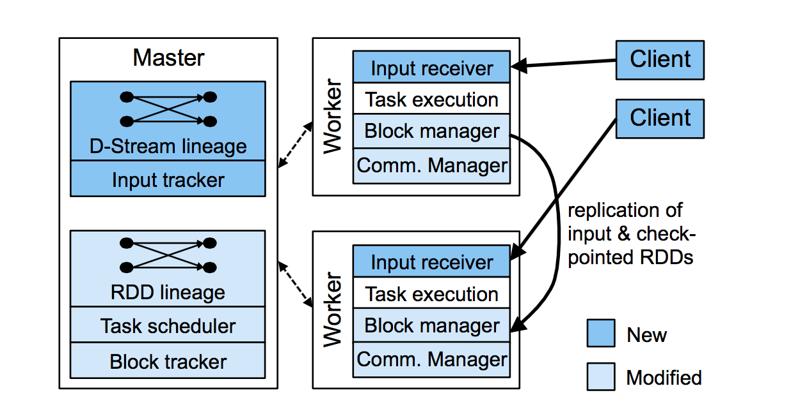

我们已经在`Spark Streaming`中实现了`D-Stream`，它是基于Spark处理引擎的一个修改版本。`Spark Streaming`由三部分组成，如图4.6所示：

图4.6，`Spark Streaming`组件，显示了我们在Spark原版本上所作的修改。

- 一个master跟踪`D-Stream` 血统图，并且调度任务产生新的RDD 分区。
- 工作节点接收数据，保存输入的分区和已计算的RDD，并执行任务。
- 一个客户端库用来发送数据给系统。

如上图所示，`spark streaming`重用了spark的很多组件，也同时添加和修改了几个组件从而适应流式处理。我们将在4.42节讨论这些改变。

从架构图可以看出，`Spark Streaming`和传统的流式处理系统的不同是，`Spark Streaming`将计算分解成小的、无状态的、确定的任务。每个任务都可以运行在集群的任何节点上，
甚至多个节点上。在传统系统的固定拓扑结构中，将部分计算过程转移到另一台机器是一个很大的动作。`Spark Streaming`可以非常直接地在集群上进行负载均衡，应对故障或启动慢节点恢复。
基于同样地原因，这种方法也可以用于批处理系统，如`Map-Reduce`。然而，`Spark streaming`的任务非常短，因为其运行在内存中，所以通常只需要50ms到200ms。

`Spark Streaming`的所有状态都存储在容错数据结构RDD中，而不是先前系统中长任务操作处理过程的一部分。由于RDD分区被确定性地计算出来，它可以驻留在任何节点上，甚至可以在多个节点上进行计算。
这个系统尽量将状态和任务放在本地以最大化数据本地化，同时这种潜在的灵活性使得推测执行和并行恢复成为可能。

这些优势来自于我们运行任务在批处理系统（`spark`）上，但是我们仍然需要做出显著的改变来支持流式处理。在介绍这些修改之前，我们先讨论任务执行的更多细节。

# 应用程序执行

`Spark Streaming`应用程序以定义一个或者多个输入流开始。系统既可以直接从客户端接收数据来加载流，也可以从外部存储系统，如`HDFS`，中周期性的加载数据。在前面的方式中，我们要确保新的数据
在发送一个确认到客户端库之前，新的数据可以两个工作节点间复制，这是因为`D-stream`需要输入的数据被可靠地进行存储来重新计算结果。

所有的数据在每一个工作节点上被一个块存储（*block store*）进行管理，同时利用主服务器上的跟踪器来让各个节点找到数据块的位置。因为于我们的输入数据块和我们从数据块计算得到的RDD的分区是不可变的，
因此对块存储的跟踪是相对简单的。每一个数据块只是简单的给定一个唯一ID，并且所有拥有这个ID的节点都能够对其进行操作（例如多个节点计算它）。块存储将新的数据块存储在内存中，并且会以`LRU`策略将这些数据块丢弃，这在后面会进行描述。

为了决定什么时候开始处理一个新的时间段，我们假设各个节点通过NTP进行了时钟同步。在每个时间段结束时，每个节点会向master发送它们接收的块IDs。主服务器之后会启动任务来计算这个周期内的输出RDDs，不需要其它更进一步的同步。
和其它批处理调度【61】一样，一旦完成上个任务，它就简单地开始后续任务。

`Spark Streaming`的每个时间阶段都依赖于spark现有的批处理调度。并加入了像`DryadLINQ`【115】系统中使用的大量优化。

- 它对一个单独任务中的多个操作进行了管道式执行，如一个map操作后紧跟着另一个map操作。
- 它根据数据的本地性对各个任务进行调度。
- 它对RDD的各个分区进行了控制，以避免在网络中`shuffle`数据。例如，在`reduceByWindow`操作中，每一个周期内的任务需要从当前的周期内“增加”新的部分结果（例如，每一个页面的点击数），和“删除”多个周期以前的结果。
调度器使用相同的方式对不同周期内的状态RDD进行切分，以使在同一个节点的每一个key的数据(例如,一个页面) 在各时间分片间保持一致。

# 流处理优化

