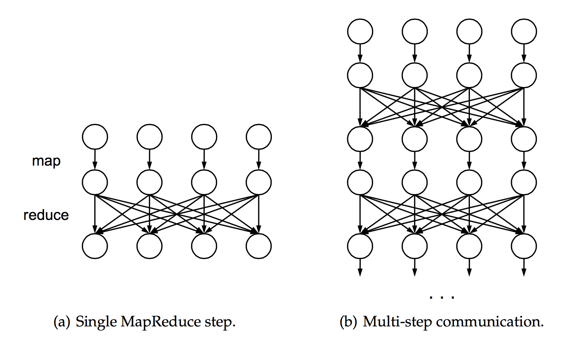

为了从理论的角度描述`RDD`的表现力，我们拿`RDD`与`MapReduce`模型进行比较，`MapReduce`模型是`RDD`模型的基础。MapReduce 最初是被用于大规模集群的计算，从 SQL【104】到机器学习【12】，但是逐渐被其他特定系统取代。

# `MapReduce`可以处理哪些计算

我们关注的第一个问题是`MapReduce`可以表达（`express`）哪些计算。尽管有很多`MapReduce`局限性的讨论并且有很多系统扩展了它，令人惊奇的答案是*`MapReduce`可以模拟任何分布式计算*。

注意，任何分布式系统都由节点的本地计算和偶尔的消息交换组成。`MapReduce`提供了`Map`操作-它允许本地计算，`Reduce`操作-它允许所有节点之间的通讯。因此，任何分布式系统都可以模拟（可能有一些不高效）。
`MapReduce`将计算分解为多个时间步长（`timestep`），在每个时间步长中，用`Map`执行本地计算，并且在时间步长的结尾，进行消息打包和交换。一系列的`MapReduce`步骤足以获得最后的结果。图5.1显示了这些步骤如何执行。

图 5.1。使用 MapReduce 模拟一个任意的分布式系统。如(a)所示，`MapReduce`提供了本地计算以及所有结点相互间通信的原语。如(b)所示，通过将这些步骤链接在一起，我们能够模拟任意的分布式系统。这个模拟的主要代价是每一轮的延迟以及步骤之间状态传递的开销。

两个原因使这样的模拟不高效。第一，就如我们在论文的后面部分谈到的那样，`MapReduce`在时间步长之间`共享数据`是低效的，因为它依赖于外部存储系统中的副本数据。所以，我们模拟的分布式系统
可能非常慢，因为我们需要在每个时间步写出数据。第二，`MapReduce`步骤的延迟将会决定我们的模拟和真实网络的匹配程度，大部分的`MapReduce`实现都被设计成批处理作业，它们的延迟有几分钟甚至几小时。

`RDD`架构和`Spark`系统解决了这两方面的限制。在数据共享方面，`RDD`通过避免复制的方式，使得数据快速共享。能够比较贴切地模拟跨越时间的 “内存数据共享”（这在由多个长驻进程组成的分布式系统中可能会发生）。
在延迟方面上，`Spark`显示了在100多个节点组成的商业集群中执行`MapReduce`计算任务，有100ms的延迟——没有固有的`MapReduce`模型能够避免延迟。虽然一些应用程序可能需要更细粒度的时间步长和通信，
但是100ms的延迟已经足够实现许多数据密集型的计算，而在通信很多的情况下，大量的计算可以被批量执行。

# 血统和错误恢复

基于`RDD`的模拟的一个令人感兴趣的特征是它提供了容错。特别的，每个计算步骤的RDD仅仅比前面步骤的RDD多一个常数大小的继承结构，这意味着存储`lineage`和执行故障恢复的代价很小。

想象一下我们模拟一个由多个单节点处理组成的分布式系统，系统通过固定数据的步骤交换消息，每个步骤的本地事件处理在“map”函数中循环进行（它的旧状态作为输入，新状态作为输出），然后在时间步长间使用`reduce`函数来进行消息的交换。
只要将每个过程中的程序计数存储在它的状态里，这些`map`和`reduce`函数在每个时间步骤中是*一样*的：它们仅仅读取程序的计数，接受消息和状态，然后模拟执行过程，因此它们能够在常量空间内编码。虽然将程序计数添加为状态的一部分可能会带来一些花费，
但这些花费仅仅是状态大小的很小一部分。并且这些状态只是在节点本地共享。

默认情况下，上面模拟过程的血统图可能使恢复状态很昂贵，这是因为每一步都增加了一个新的所有节点间的`shuffle`依赖。但是，如果应用程序将计算语义表达的更精确（比如：指明某些步骤仅仅产生窄依赖），或者将每个节点的工作切分到多个任务，
我们就可以通过集群来并行恢复。

基于`RDD`模拟的分布式系统最后一个需要关注的问题是本地维护多个状态版本以及维护对外发送消息（`outgoing`）的拷贝的代价，这些状态会被转换操作使用，这些发送消息的拷贝是为了更方便的恢复。这个是一个不小的代价，
但是在许多场景下，我们可以通过异步的执行一段时间的状态检查点（比如, 如果检查点的可用带宽比内存带宽低10倍, 我们可以在每10个步骤执行一个检查点)来限制这个代价。或者通过存储不同版本的差异来限制这个代价。
只要每台机器上的“快速”存储足够储存对外发送的消息以及状态的一些版本，我们就可以达到专门系统相同的性能。