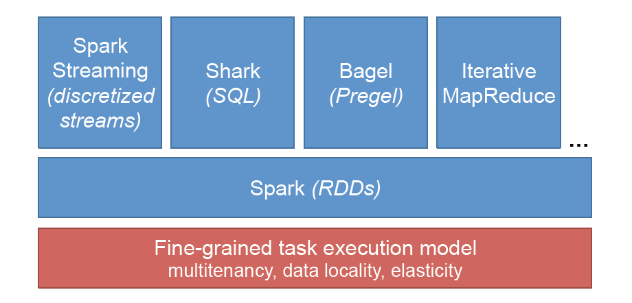

在过去几年里，我们已经看到计算系统的重大变化： 随着数据容量的日益增长越来越多的应用程序需要扩展到大型集群。在商业和科研领域，新的数据源和仪器正在产生数量快速增加的信息。
不幸的是，单一机器的处理和`I/O`能力并没有跟上这种节奏。最终,越来越多的组织需要通过扩展集群来进行计算。

集群环境同时给可编程性带来了挑战。第一是并行性：这个设置要用可捕捉广泛计算的编程模型以并行方式来重写应用程序。然而，不同于其他并行式平台，
集群的第二个挑战是故障：彻底的节点故障和`stragglers`(慢节点)很常见，逐渐形成规模并极大的影响应用程序的性能。最后一个挑战是，集群通常在多个用户之间共享，需要在运行时可以动态地进行上下扩展计算，也加剧了干扰的可能性。

因此，广泛的新编程模型已经为集群而设计。起初，谷歌的`MapReduce`【36】发布了一个简单通用的模型，可以为批处理自动解决故障。
然而，人们发现`MapReduce`并不适用于其他类型的工作负载，导致广泛的和`MapReduce`具有显著不同的专有模型。例如，在谷歌，`Pregel`【72】为迭代图算法提供了
一个整体同步并行计算模型(`BSP`)；`F1`【95】 运行快，但不支持容错和SQL查询；`MillWheel`【2】支持连续流处理。谷歌以外，比如`Storm`【14】,`Impala` 【60】, `Piccolo`【86】 和 `GraphLab`【71】
这些系统提供了相似的模型。随着新模型在每年中不断被实现，集群计算必然需要一系列针对不同任务的点解决方案。

本论文认为，相反地，我们可以设计出一种不仅可以捕捉这些迥然不同的工作负载而且能够支持新的应用程序的统一的编程抽象。尤其，我们可以表明一种简单的`MapReduce`扩展称作弹性分布式数据集（`RDDs`），
仅仅添加了一些有效数据的共享原语，就大大增加了它的通用性。由此而开发的架构比当前的一些系统拥有几个关键性优势。

- 1　在相同运行时下，它支持批处理、交互、迭代和流计算，从而能够丰富那些结合了这类模型的应用程序，并给这些组合的应用程序提供明显高于全异系统的好性能。

- 2　它以非常低的成本提供了这些计算模式间的错误和慢任务(`stragglers`)容错的能力。事实上，在一些领域（流和`SQL`），我们基于`RDD`的方法而形成的新系统的设计具有明显强于现状的容错特征。

- 3　它实现的性能通常是`MapReduce`的100倍，并且比得上单独的应用程序域中的专业系统。

- 4　它非常适合多租户，允许应用程序向上向下灵活扩展并且在响应的方式下共享资源。

我们在一堆开源的系统中实现了`RDD`架构：`Apache Spark`作为共同的基础，`Spark`用来`SQL`处理，`Spark`流用来分布式流处理（图1.1）；借助真正的用户程序和传统的基准评估这些系统；
我们的实现为传统和新的数据分析工作负载，提供了一流的性能，以及第一个可以让用户构成这些工作负载的平台。

从长期的角度看来，我们也讨论了通用的技术来实现`RDDs`上的多样数据的处理任务，和为什么`RDD`模型会是如此普遍。随着集群应用程序复杂性的日益增加，我们相信这种由`RDDs`提供的统一的
处理架构将会在性能和易用性上变得日益重要。

- **论文声明**：一种常见的基于弹性分布式数据集的执行模型可以有效地支持各种各样的分布式计算。

在本章的其余部分，我们调查了`RDD`架构的一些内因，然后突出我们的关键结果。

# 1.1专业系统的缺点

如今的集群计算系统越来越专用于特定的应用领域。像`MapReduce`和`Dryad` 【36, 61】这些模型致力于捕捉相当通用的计算，然而研究人员和从业人员已经为新应用领域开发出越来越多的专业系统。

这个计算堆栈在本论文中实现。借助`RDDs`的`Spark`实现，我们建立了其他的处理模型，比如流（`streaming`）, `SQL` 和图像计算（`graph computations`），所有这些都可以混合在`Spark`程序中。
`RDDs`本身用一系列的细粒度任务来执行应用程序，促使有效的资源共享。

例子中包含用于交互式`SQL`的`Dremel`和`Impala`【75, 60】，用来图像处理的`Pregel`【72】，用于机器学习的`GraphLab`【71】和其他。虽然专业系统看起来用一种自然的方式来缩小分布式环境中的挑战性问题，
也有下面列的几个缺点：

- 1　 **重复工作**　许多专业系统仍然需要解决相同的底层问题，比如工作分配和容错。举个例子，一个分布式的`SQL`引擎或者机器学习引擎都需要执行并行的聚合。由于系统独立，
这些问题需要为每个域重新加以解决。

- 2　 **构成**　在不同的系统中组合计算是既昂贵又笨重的。尤其对于“大数据”应用程序，移动中间数据集是大型和昂贵的。当前环境需要导出数据到一个复制的稳定存储系统，以在计算引擎之间进行共享，
这通常是实际计算量的数倍成本花费。因此构成多个系统的管道组往往比一个统一的系统效率更加低下。

- 3　 **有限的范围**　如果一个应用程序不符合一个专业系统的编程模型，用户必须修改它使它适用当前的系统，否则要重新写一个新的运行时系统。

- 4　 **资源共享**　计算引擎间的动态资源共享是困难的，因为大多数引擎认为他们在应用程序执行期间拥有相同的一组机器。

- 5　 **组织和管理**　独立的系统间比单独一个之系统需要更多的管理和部署工作。即使对用户来说，他们需要学习多种`API`和执行模型。

由于上面这些限制，一个统一的集群计算的抽象将会有很显著的提高，不仅仅在可用性上面，而且在性能上，尤其是对于复杂应用程序和多用户的设置。