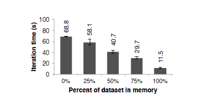

# 2.6　评价

我们通过在`Amazon EC2` 上进行一系列的实验和用户应用程序的基准测试，对`Spark`和`RDDs`进行了性能评估。总体而言，我们的测试结果显示如下：
- 在迭代机器学习和图形应用程序中，`Spark` 性能要比`Hadoop` 模型好80倍。这些性能提升来自于将数据以`java` 对象存入内存从而避免系统` I/O `和反序列化带来的成本。
- 用户应用程序同样有很好的性能和扩展性。尤其，我们使用 `Spark` 来运行一个原本运行在`Hadoop`上的分析报告，性能提升了 40 倍.。
- 当出现节点故障时，`Spark`可以通过只重建那些丢失的`RDD` 分区，从而快速地故障恢复。
- `Spark` 可以在 5-7 秒延迟内交互式地查询 1 `TB` 的数据集。

我们首先提供了基准测试，为迭代机器学习（§2.6.1)）以及`PageRank` 算法（§2.6.2）与`Hadoop`进行了对比。然后评估了`Spark`的容错性（§2.6.3）
和数据不能完全存入内存（§2.6.4）时的状况表现。最后，我们讨论了它们在交互式数据挖掘（§2.6.5）和一些真实用户应用程序（§2.6.6）中的表现。

除非另有说明，我们在测试中使用` m1.xlarge EC2` 节点，配有 4 核`CPU` 和 15 `GB` 的内存。我们使用`HDFS` 来存储数据，每个文件块是256`MB`。
每次测试之前，我们都会清除操作系统的缓冲区，从而得到更精确的`I/O` 开销。

# 2.6.1 迭代式机器学习应用

我们实现了两种迭代式机器学习应用，逻辑回归和 k-均值算法（`k-means`），来对以下系统进行性能对比：
- `Hadoop` ：` Hadoop 0.20.2` 稳定版
- `HadoopBinMem`：一种`Hadoop`，在首轮迭代中将输入数据转换成为开销较低的二进制格式，从而削减了后续迭代中文本解析的开销，并将数据存储在基于内存的`HDFS` 中。
• `Spark`：我们的`RDDs`的实现版本。

图 2.7 在一个 100节点集群上处理 100`GB`数据的逻辑回归和k-均值算法，`Hadoop`，`HadoopBinMem`和`Spark` 各自的首次迭代和后续迭代时长。

我们使用 25-100 台机器来运行两种算法，在 100`GB`数据集上迭代 10 次。两个应用的关键区别在于对每个字节数据的计算量不同。
`k-means`的迭代时间取决于计算量，然而逻辑回归并非计算密集型的，对反序列化和`I/O` 时间开销更敏感。

由于典型的机器学习算法需要数十轮迭代直到收敛，我们分别统计了首轮迭代和后续迭代的耗时。我们发现通过`RDDs`共享数据极大地加快了后续迭代的速度。

**首轮迭代**：在首轮迭代过程中，所有 3 个系统都是从`HDFS`中读取文本数据作为输入数据。如图 2.7 中的浅色条所示，整个实验中`Spark`都要比`Hadoop`快一些。
差异是因为`Hadoop`中的`Master` 和`Slave`之间基于心跳协议的信令开销。`HadoopBinMem` 是最慢的，因为它运行了一个额外的`MapReduce` 作业来将数据转换成二进制格式，
并且它需要通过网络传输将数据写入备份的内存式HDFS 实例中。
**后续迭代**：图 2.7 显示了后续迭代的平均耗时。对于逻辑回归，在 100 台机器上运行，`Spark`分别比`Hadoop`和`HadoopBinMem`快 85 和 70 倍。
对于更加计算密集型的` K-means`，`Spark`仍然分别比`Hadoop`和`HadoopBinMem`快 26 和 21 倍。注意在所有这些案例中，程序通过同样的算法计算出了同样的结果。
**理解速度提升**： 我们非常惊奇地发现，`Spark`甚至超过了基于内存存储二进制数据的 `Hadoop(HadoopBinMem)`高达 85 倍之多。
在`HadoopBinMem`中，我们使用`Hadoop`的标准二进制格式（序列文件）和 256` MB` 的大文件块，并且我们强制使`HDFS`的数据目录加载到内存文件系统中。
然而，`Hadoop`仍然运行的比较慢，是由于以下几个原因：

1. `Hadoop`软件栈的最低开销
2. `HDFS` 读取数据的开销
3. 将二进制记录转化为可用的在内存中的`Java` 对象的反序列化的代价

我们通过单独的微基准测试确认了这些因素。例如，为了测试`Hadoop`的启动开销，我们运行空操作（`no-op`）的`Hadoop`作业，观察到仅仅完成作业的最小需求：设置、启动任务、清理工作就
至少耗时 25 秒。至于`HDFS` 的开销，我们发现为了维护每一个数据块，`HDFS`进行了多次内存复制以及校验和计算。最后，我们发现，即使是在内存中的二进制数据，通过`Hadoop`
的`SequenceFileInPutFormat` 读取数据来反序列化这一步，也比逻辑回归的计算花费了更多时间，这解释了为什么`HadoopBinMem`更慢。

# 2.6.2 `PageRank`

图 2.8 在`Hadoop`和`Spark`各自执行`PageRank`的性能

我们对一个 54`GB` 的维基百科数据进行`PageRank`来比较`Hadoop`和`Spark`的性能。我们对`PageRank`算法迭代 10 次，处理一个大约有 400 万词条的连接图。
由图 2.8 可见，在 30个节点的集群上，基于内存存储的`Spark`获得了相较于`Hadoop` 2.4 倍的性能提升。此外如 2.3.2 章节所述，控制`RDDs` 的分区
使其在每次迭代中保持一致，可以将性能提升到 7.4 倍。同样，当节点扩展到 60个时，性能也保持着线性增长。

我们也评测了一种基于`Spark`的`Pregel` 实现的`PageRank`（将在 2.7.1 小节描述）。迭代次数和图 2.8描述类似，但大约长了 4 秒钟。
这是因为每轮迭代中，`Pregel`都需要额外的运算让顶点“投票”决定是否结束作业。

# 2.6.3 故障恢复

# 2.6.4 内存不足的表现

# 2.6.5 交互式数据挖掘

# 2.6.6 实际应用

