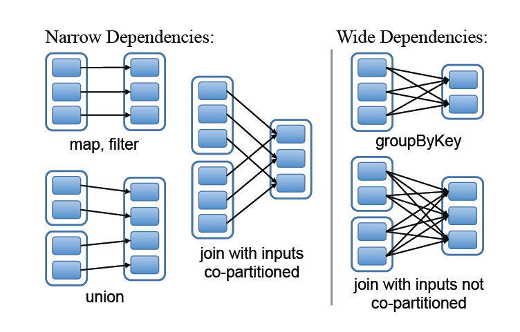
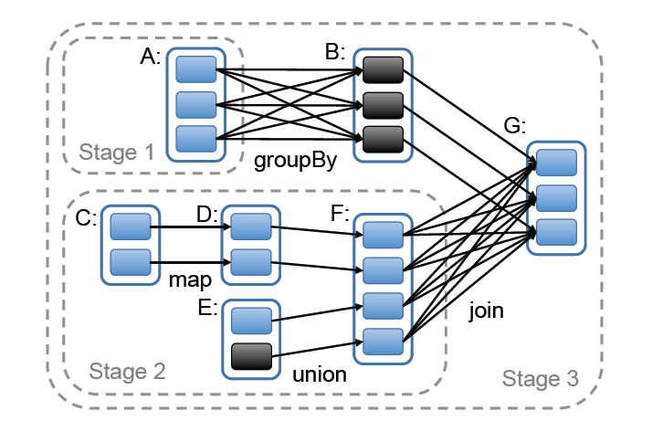
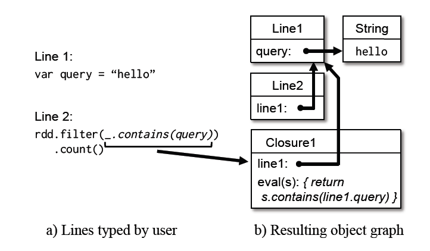

# 2.5　实现

我们用大概34000行的`Scala`语言实现了`Spark`。系统运行在各种各样的集群`managers`（包括`Apache Mesos`【56】，`Hadoop YARN`【109】和`Amazon EC2`【4】）上，和它自己的内置集群`manager`。
每个`Spark`程序在集群上有着自己的驱动（`master`）和工作进程，作为一个独立的应用程序运行，并且这些应用程序间的资源共享是由集群`manager`处理的。

图2.4．　窄依赖和宽依赖的例子。每一个方框表示一个`RDD`，其内的阴影矩形表示`RDD`的分区。

`Spark`能够借助`Hadoop`现有的输入插件`APIs`从任何一个`Hadoop`输入源（例如，`HDFS`或者`HBase`）读取数据，并且在`Scala`的一个未修改版本上运行。

现在我们来描述几种系统中有趣的技术组件：作业调度程序（2.5.1节），多租户支持（2.5.2节），支持交互式使用的`Spark`解析器（2.5.3节），内存管理（2.5.4节），并且支持检查点（2.5.5节）。

# 2.5.1　任务调度

`Spark`的调度器使用了我们在 2.4 节所描述的`RDD`。

总的来说，我们的调度器类似于`Dryad`的【61】，但它会额外地考虑被持久化(`persist`)的`RDD`的哪些分区在内存中是可使用的。当用户对一个`RDD`执行`Action` (如`count` 或`save`)操作
时， 调度器会检查该`RDD`的血统图，来构建一个由若干阶段(`stage`) 组成的一个`DAG`(有向无环图)以执行程序，正如 2.5 所示。 每个`stage`都包含尽可能多的流水式的窄依赖型转换。各
个阶段之间的分界则是宽依赖所需的`shuffle` 操作，或者是任何一个DAG 中经由该分区能更快到达父`RDD`的已计算分区。然后，调度器启动多个任务来计算各个阶段所缺失的分区，直到最终计算出目标`RDD`。

我们的调度器根据数据存储位置，采用延时调度机制【117】来给各机器分配任务。若一个任务需要处理的某个分区刚好存储在某个节点的内存中，则我们会把该任务分配给那个节点。
否则，如果一个任务需要处理的某个分区，其含有的`RDD`提供了优先的位置(例如，一个`HDFS` 文件)，我们就把该任务分配到这些位置。

对于宽依赖的操作（比如`shuffle`依赖)，我们会将中间记录物理化到保存了父分区的节点上，从而来简化故障恢复，这和`MapReduce` 物化`Map`的输出非常类似。

图 2.5.`Spark` 如何计算`job` 的`stage` 的例子。实线圆角方框标识的是`RDDs`。阴影背景的矩形是分区，黑色表示已存于内存中。为了在`RDD G `上执行一个`Action `，我们以宽依赖为分区来构建各个`stage`，
并在各个`stage`的内部把窄依赖前后连接成流水线。在本例中，`stage`　1 的输出`RDD`已经存在于`RAM`中，所以我们直接执行`stage`　2 ，然后 `stage`　3。

对于执行失败的任务，只要它对应`stage`的父分区信息仍然可用，我们便可以在其他节点上重新运行它。如果某些`stage`变得不可用了（例如，因为`shuffle`在`map` 阶段的某个输出丢失了），我们就重
新提交相应的任务来并行计算丢失的分区。尽管拷贝相应`RDD`的血统图是比较直接的解决之道，我们也不能容许调度器器自身失败。

若某个任务执行缓慢 (即是一个慢任务`straggler`)，系统则会在其他节点上执行该任务的拷贝--这与`MapReduce`做法类似【36】，并优先取最先完成的备份的结果。

最后，虽然目前在`Spark` 中所有的计算都是为了响应驱动程序中调用的动作而执行，我们也试验了让集群上的任务（如映射）来调用查找操作，该操作可以根据键值随机地访问哈希分区`RDDs`
的元素。在这种设计下，如果任务所需要的分区丢失了，则它需要告知调用器去重新计算该分区。

# 2.5.２　多租户

由于`RDD`模型将计算分解为多个相互独立的细粒度任务，使得它在多用户集群上能支持各种资源共享算法。特别地，每个`RDD`应用可以在执行过程中动态的向上或向下扩展，并且可以轮询访问每台机器，
或者可以被高优先级的应用快速占用。`Spark` 应用中大多数的任务的执行周期在 50 毫秒到数秒之间，使得共享请求能得到快速响应。

虽然多用户共享算法并非本论文的重点，我们也列出了可用的那些具体算法，如下，来尽可能给我们的读者关于资源共享选项的认识。

- 在每个应用程序中，`Spark`允许多线程同时提交作业，并通过一种等级公平调度器来实现资源的分配。这种调度器和` Hadoop Fair Scheduler `【117】类似。 此特
性主要用于创建基于针对相同内存数据的多用户应用，例如：`Shark SQL` 引擎有一个服务器模式支持多用户并行的查询。公平共享确保作业彼此的分离，同时短作业能在即使长
作业占满集群资源的情况下也尽早地完成。

- `Spark`的公平调度也使用延迟调度【117】，通过轮询访问每台机器的数据，在保持公平的情况下给予作业高度的数据本地性。在本章几乎所有的试验中，内存本地化访问(
`Memory　Locality`)为 100%。`Spark`支持多级的本地化访问策略(本地性)，包括内存、磁盘和机架，以降低在一个集群里不同方式的数据访问的代价。

- 由于任务相互独立，调度器还支持取消作业来为高优先级的作业腾出资源【62】。

- 纵观`Spark`的应用，`Spark`仍然使用`Mesos`【56】 中资源供给的概念来支持细粒度共享，它让不同的应用通过一个通用的`API` 发起集群上的细粒度任务请求。
这使得`Spark`应用能相互之间或在不同的计算框架（例如`Hadoop`）之间实现资源的动态共享。延迟调度仍然能够在资源供给模型中提供数据本地性。

- 最后，`Spark`已经被扩展，使用`Sparrow` 系统支持分布式调度【83】。该系统允许多个`Spark`应用在同一集群上以非集中化的方式排队工作，同时提供数据本地性、低延迟和公平性。
当多个应用同时提交任务时，通过避免集中化的方式，分布式调度可极大地提升系统的可扩展性。

由于绝大多数的集群是多用户环境，它们的工作负载之间的交互程度也在增加。这样，相较于比较传统的静态分区的集群，上述特性使得`Spark`的性能得到显著的提升。

# 2.5.3 Interpreter Integration

类似于`Ruby` 和`Python` ，`Scala` 提供了一个交互式`Shell`(解析器)。借助内存数据所带来的低延迟性，我们希望用户能通过解析器来运行`Spark`并对大数据集进行交互式查询。

图 2.6.`Spark`解析器将用户输入的命令行解析为相应`Java` 对象的示例。

#　2.5.4 内存管理

#　2.5.5 支持检查点

