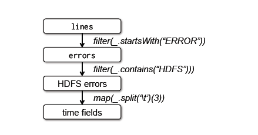
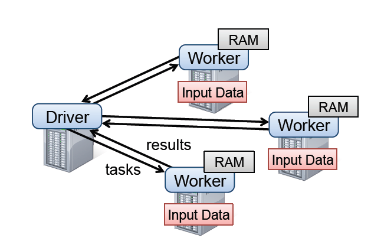
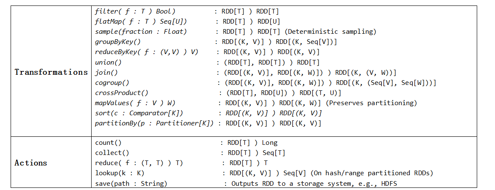

# 2.2　`RDD`抽象

本节概述了一下`RDDs`。我们首先定义`RDDs`（`x2.2.1`），并且介绍下它们的在`Spark`（`x2.2.2`）上的编程接口。然后我们把`RDDs`
和细粒度共享内存抽象比较一下(`x2.2.3`)。最终，我们讨论了`RDD`模型的局限之处(`x2.2.4`)。

# 2.2.1　定义
形式上看，`RDD`是一个只读的、分区的记录集。`RDDs`只能通过对稳定存储的数据或者其他`RDDs`的确定性操作来创建。我们把这些操作称为转换，可以把它们和其他
`RDDs`的操作区分开来的。转换的例子有`map`、过滤和连接。

`RDDs`不需要总是被物化。相反，一个`RDD`拥有足够的关于其如何从其他数据集衍生（血统）而可以从稳定存储的数据计算它的分区。这是一个强大的特性，本质上，
一个程序不能参照一个并不能在失败后重建的`RDD`。

最后，用户可以控制`RDDs`的其他的两个方面：`persistence`和分区。用户可以表明他们将要重用哪一个`RDDs`并且为它们选择一个存储策略（例如，内存存储）。
他们也可以要求一个`RDD`的元素是基于每条记录的一个键值跨机器分区的。这对位置优化是有用处的，比如说可以确保两个将被连接起来的数据集是以同样方式进行哈希分区的。

# 2.2.2　`Spark`编程接口
`Spark`通过一个类似于`ryadLINQ`【115】和`FlumeJava`【25】的集成语言`API`开放了`RDDs`，其中每个数据集由一个对象代表，而转换可以由这些对象上的方法调用。

程序员首先通过稳定存储的数据的转换（例如`map`和过滤）定义一个或者多个`RDDs`，然后他们可以使用`RDDs`的动作类`actions`，这是可以向应用程序返回一个值或者把数据导出到一个存储
系统的操作。动作类`actions`的例子有计数`count`（返回数据集中元素的数目），`collect`（返回数据元素本身）和`save`（把数据集输出到存储系统）。像`DryadLINQ`那样，`Spark`
直到第一次调用`RDDs`的动作时，才开始计算`RDDs`，使得`Spark`可以按序缓存多个变换。

此外，程序员可以调用一种`persist`方法，来表明他们在未来的操作中想重用这一种`RDDs`。`Spark`默认在内存中保存了持久的`RDDs`，但是如果内存不足，它也可以把`RDDs`写入硬盘中。
用户也可以请求其他的持久性策略，通过标记来进行持久化`persist`，比如说把`RDD`只存储在硬盘上或者跨机器去进行复制。最后，用户可以在每个`RDD`上设置一个持久化优先级，来指定
某个内存数据可以优先写入磁盘中。

 **例子：控制台日志挖掘**　
假设一个`web`服务遇到错误，而操作员想要在`Hadoop`文件系统（`HDFS`【11】）中搜索万亿字节的日志来找到原因。借助`Spark`，操作员可以跨一组节点就把错误信息从日志中加载到内存中，
且交互地进行查询。可以先键入以下的`Scala`代码：
 
```scala
lines = spark.textFile("hdfs://...")
errors = lines.filter(_.startsWith("ERROR"))
errors.persist()
```

第一行定义了由一个`HDFS`文件（作为一个行文本集）返回的`RDD`，而第二行则由它衍生了一个过滤的`RDD`。然后第三行要求错误持久存储在内存中，从而可以在查询之间共享。
请注意，过滤的参数是一个`Scala`闭包的语法。

到此，集群还没有执行工作。然而，用户可以使用`RDD`的动作了，比如去计算信息的数量：
`errors.count()`



图2.1示例中第 3 个查询的`lineage`示意图，方块代表`RDDs`，箭头表示的转换。

用户也可以在`RDD`执行进一步的转换，并使用他们的结果，如下面几行：

```scala
// Count errors mentioning MySQL:
errors.filter(_.contains("MySQL")).count()
// Return the time fields of errors mentioning HDFS as an array, assuming
// time is field number 3 in a tab-separated format:
errors.filter(_.contains("HDFS"))
.map(_.split('\t')(3))
.collect()
```

在第一个涉及错误的动作运行之后，`Spark`会把出错的分区存储在内存中，这会大大的加快它的后续操作。请注意基层的`RDD`、行并没有加载到内存中。
这是可取的，因为错误信息可能只是数据的一小部分（足够小，所以适合内存存储）。

最后，为了说明我们的模型是怎么实现容错的，我们展示了图2.1中第三个查询的`RDDs`血统图。在这个查询中，我们从错误开始，得出其所对应的`RDD`行，接着对行
进行过滤操作，之后再次进行过滤、`Map` 操作，最后进行`collect`。　`Spark`调度器将会对最后的两个转换操作进行排队，并且发送一组计算任务给那些保存了错误的缓存分区节点。
此外，如果一个错误分区丢失，`Spark`可以通过在相应的分区行上应用一个过滤器去重新构建它。

# 2.2.3　`RDD`模型的优点

|方面|`RDDs`|分布式共享内存|
|---|:---|:---:|
|读|粗粒度或细粒度|细粒度|
|写|粗粒度|细粒度|
|一致性|不值一提的（稳定的）|取决于`app`和运行时|
|故障恢复|基于血统的细粒度和低开销|需要检查点和程序回滚|
|慢任务缓解|可能使用备份任务|困难|
|工作布置|基于数据位置的自动化|取决于`app`（运行时要清楚）|
|内存不足时的表现|类似于现有的数据流系统|性能差（`swapping?`）|
表2.1．　`RDDs`和分布式共享内存之间的比较

为了理解`RDDs`作为一个分布式内存抽象的优点，我们在表2.1中把它和分布式共享内存（`DSM`）作了一下比较。在`DSM`系统中，应用程序在一个全球的地址空间可以向任意的位置写和读。
注意在这个定义下，我们不仅包括传统的共享内存系统【79】，而且也有那些应用程序细粒度写入共享状态的其他系统，如`Piccolo`【86】，提供了一个共享的`DHT`和分布式数据库。
`DSM`是一个非常通用的抽象，但是这个通用性使它在商业集群上实现高效和容错变得比较困难。

`RDDs`和`DSM`之间的主要区别是`RDDs`只能够通过粗粒度转换来创建（“写”），然而`DSM`却可以向每个内存位置读和写。这限制了`RDDs`向应用程序的批量写入操作，却具有更高效的容错。
特别是，`RDDs`不需要应付检查点的开销，因为它们可以使用血统图而恢复。此外，只有`RDD`的丢失分区需要重新计算，而且它们可以在不同的节点上并行地重新计算，并不需要回滚整个程序。

`RDDs`的第二个优点是它们不变的性质，可以通过运行`MapReduce`【36】的慢任务备份副本来缓解慢节点（`stragglers`）。备份任务在`DSM`中实现将会很困难，因为一个任务的两个副本将会访问同一
个内存位置，而干扰了彼此的更新。

最后，`RDDs`比`DSM`多了其他两个优点。首先，在`RDDs`的批操作中，一个运行时能够基于数据位置来调度任务，从而提高性能。第二，`RDDs`能够平稳的降级当没有足够的内存来存储时，只要它们
仅仅是被用于基于扫描的操作。并不适合内存的分区可以存储在磁盘上，并将提供类似于当前并行式数据系统的性能。




图2.2　`Spark`运行时．　用户的驱动程序启动了多个工作进程，从分布式文件系统里面读取数据块，并且在内存中`persist``RDD`的计算分区。

# 2.2.4　不适用于`RDDs`的应用程序

正如介绍中所讨论，`RDDs`最适合在同一个数据集的所有元素上执行相同的操作的那些批处理应用程序。在这些情况下，`RDDs`可以高效的记住每一个转换操作，作为血统图中的一个步骤，从而可以不需要记录大量的数据就
恢复了丢失的分区。`RDDs`不太适用那些对共享状态进行异步细粒度更新的应用程序，比如一个`web`应用程序的存储系统和一个增量的`web`爬虫。对于这些应用程序，使用那些可以执行传统的更新记录和数据检查点的系统将会更
高效，比如数据库，`RAMCloud` 【81】，`Percolator` 【85】和`Piccolo` 【86】。我们的目标是给批量分析提供一个高效的编程模型，并把这些异步应用程序留给专业系统来解决。尽管如此，第五章涵盖了一些可能的方法，使用
`RDD`模型来整合这些类型的应用程序，例如批量更新。

# 2.3　`Spark`编程接口

`Spark`通过类似于`Scala`【92】（一种基于`Java` 虚拟机的静态类型函数式的编程语言）中的`DryadLINQ`【115】的一个集成语言`API`提供了`RDD`抽象。我们选择`Scala`是由于它的简洁（方便互动使用）和效率（由于静态输入）的结合。
然而却没有任何关于`RDD`的抽象，需要一个函数式的语言。

为了使用`Spark`，开发人员们写了一个把一个集群的工作进程连接起来的驱动程序，如图2.2所示那样。该驱动定义了一个或多个`RDDs`，并且调用它们的动作类。磁盘上的`Spark`代码也记录了`RDDs`的血统图。
这些工作进程是可以把一连串操作的`RDD`分区存入在内存中的长期活跃的进程。

正如我们在 2.2.2 节的日志挖掘例子中所看到的，用户通过传递闭包（函数字面量）的方式将参数传递给`map`等`RDD`操作。在`Scala`中每个闭包都代表一个`Java`对象，这些对象可以被序列化，也可以加载在其他节点
并跨网络传递闭包。`Scala`会将闭包中的所有变量保存为`Java`对象的属性域。例如，我们可以写类似`var x = 5; rdd.map(_ + x)` 的代码来将 5 加到`RDD`的每个元素上。

`RDDs` 是一个通过元素类型而参数化的静态类型对象。例如`RDD[Int]`是一个整数型`RDD`。然而，我们大多数的例子中都忽略类型是因为`Scala`的类型推断。

尽管我们在`Scala`中暴露`RDDs`的方法很简单，我们却必须用反射【118】来解决`Scala` 的闭包对象问题。为了使`Spark`在`Scala`的解释器中可用，我们还需要做更多的工作，我们将在 2.5.3.节来讨论。
然而，我们没必要修改`Scala`编译器。


表 2.2`Spark` 中`RDD`的一些可用的`transform`操作和`action`  操作。`Seq[T]` 表示 `T` 类型的元素序列。

# 2.3.1　`Spark`中的`RDD`操作

表 2.2 列出了`Spark` 中`RDD`的一些主要`transform`操作和`action` 操作。我们给出了每个操作签名，方括号中显示了类型参数。我们可以将`transformations` 理解成一种惰
性操作，它只定义了一个新的`RDD`，而不立即计算它。相反，`actions` 则是启动计算返回结果给程序或者将结果写入到外部存储中。

请注意某些操作，例如`join` 只适合键值对类型的`RDDs`。此外，我们函数名的选择符合`Scala`的其他`API`和其他函数式语言的规范。例如`map` 表示一对一的映射，而`flatMap` 则表示每个输入对应一个或者多个输出的映射
（类似于`MapReduce` 中的`map`）。

除了这些操作，用户还可以请求持久化(`persist`)一个`RDD`。此外，用户可以得到一个`RDD`的分区号，它由一个`Partitioner`类表示，并且根据它划分另一个数据集。一些操作例如`groupByKey`,
`reduceByKey` 以及`sort`会自动产生一个基于哈希或者范围分区的`RDD`。

# 2.3.2　应用示例

我们用两个迭代型应用的例子来补充了一下2.2.2 节的数据挖掘示例：`logistic　regression`(逻辑回归)和 `PageRank`。后者还展示了如何控制`RDDs`的分区来提升性能。

# `Logistic Regression`(逻辑回归)

很多机器学习算法本质上是迭代型的，因为它们要运行迭代式的优化算法，比如采用梯度下降法最大化目标函数。因此，通过将数据缓存在在内存中可以加速它们运行。

作为一个例子，下面的程序实现了`logistic　regression`【53】，它是一种常见的分类算法：目的是找到一个超平面`w`，以最好地将两个点集合分开 (比如, 垃圾邮件和非垃圾邮件）。
该算法使用梯度下降法：首先对`w`取一个随机值，在每一步迭代时计算`w` 函数在数据集上的和，然后沿着梯度方向移动`w`来改进它。

```scala
val points = spark.textFile(...).map(parsePoint).persist()
var w = // random initial vector
for (i <- 1 to ITERATIONS) {
　val gradient = points.map { p =>
　　p.x * (1 / (1 + exp(-p.y * (w dot p.x))) - 1) * p.y
　}.reduce((a,b) => a + b)
　w -= gradient
}
```

首先，我们定义了一个持久化的`RDD`称之为 `points` ，它是通过对文本文件做`map` 转换（对每一行文本解析得到一个`Point` 对象）得到的结果。然后我们在每一步都重复的
对`points`执行`map` 操作和`reduce` 操作来计算梯度，梯度是对当前`w` 的函数求和得到。如 2.6.1.节所述，在每一步迭代中将`points`缓存在内存中能够获得 20 多倍的速度提升。


