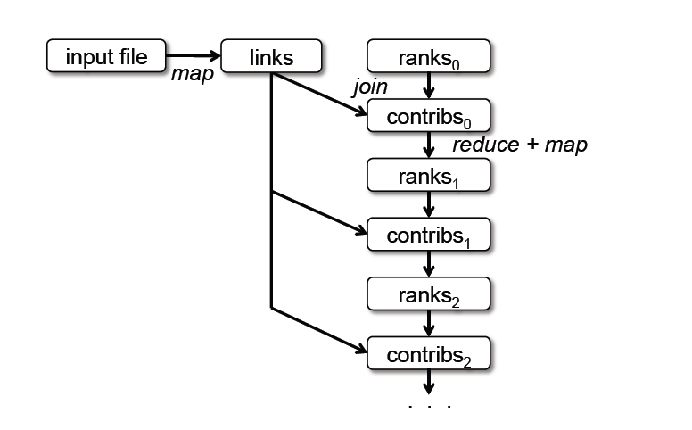

# 2.3　`Spark`编程接口

`Spark`通过类似于`Scala`【92】（一种基于`Java` 虚拟机的静态类型函数式的编程语言）中的`DryadLINQ`【115】的一个集成语言`API`提供了`RDD`抽象。我们选择`Scala`是由于它的简洁（方便互动使用）和效率（由于静态输入）的结合。
然而却没有任何关于`RDD`的抽象，需要一个函数式的语言。

为了使用`Spark`，开发人员们写了一个把一个集群的工作进程连接起来的驱动程序，如图2.2所示那样。该驱动定义了一个或多个`RDDs`，并且调用它们的动作类。磁盘上的`Spark`代码也记录了`RDDs`的血统图。
这些工作进程是可以把一连串操作的`RDD`分区存入在内存中的长期活跃的进程。

正如我们在 2.2.2 节的日志挖掘例子中所看到的，用户通过传递闭包（函数字面量）的方式将参数传递给`map`等`RDD`操作。在`Scala`中每个闭包都代表一个`Java`对象，这些对象可以被序列化，也可以加载在其他节点
并跨网络传递闭包。`Scala`会将闭包中的所有变量保存为`Java`对象的属性域。例如，我们可以写类似`var x = 5; rdd.map(_ + x)` 的代码来将 5 加到`RDD`的每个元素上。

`RDDs` 是一个通过元素类型而参数化的静态类型对象。例如`RDD[Int]`是一个整数型`RDD`。然而，我们大多数的例子中都忽略类型是因为`Scala`的类型推断。

尽管我们在`Scala`中暴露`RDDs`的方法很简单，我们却必须用反射【118】来解决`Scala` 的闭包对象问题。为了使`Spark`在`Scala`的解释器中可用，我们还需要做更多的工作，我们将在 2.5.3.节来讨论。
然而，我们没必要修改`Scala`编译器。


表 2.2`Spark` 中`RDD`的一些可用的`transform`操作和`action`  操作。`Seq[T]` 表示 `T` 类型的元素序列。

# 2.3.1　`Spark`中的`RDD`操作

表 2.2 列出了`Spark` 中`RDD`的一些主要`transform`操作和`action` 操作。我们给出了每个操作签名，方括号中显示了类型参数。我们可以将`transformations` 理解成一种惰
性操作，它只定义了一个新的`RDD`，而不立即计算它。相反，`actions` 则是启动计算返回结果给程序或者将结果写入到外部存储中。

请注意某些操作，例如`join` 只适合键值对类型的`RDDs`。此外，我们函数名的选择符合`Scala`的其他`API`和其他函数式语言的规范。例如`map` 表示一对一的映射，而`flatMap` 则表示每个输入对应一个或者多个输出的映射
（类似于`MapReduce` 中的`map`）。

除了这些操作，用户还可以请求持久化(`persist`)一个`RDD`。此外，用户可以得到一个`RDD`的分区号，它由一个`Partitioner`类表示，并且根据它划分另一个数据集。一些操作例如`groupByKey`,
`reduceByKey` 以及`sort`会自动产生一个基于哈希或者范围分区的`RDD`。

# 2.3.2　应用示例

我们用两个迭代型应用的例子来补充了一下2.2.2 节的数据挖掘示例：`logistic　regression`(逻辑回归)和 `PageRank`。后者还展示了如何控制`RDDs`的分区来提升性能。

# `Logistic Regression`(逻辑回归)

很多机器学习算法本质上是迭代型的，因为它们要运行迭代式的优化算法，比如采用梯度下降法最大化目标函数。因此，通过将数据缓存在在内存中可以加速它们运行。

作为一个例子，下面的程序实现了`logistic　regression`【53】，它是一种常见的分类算法：目的是找到一个超平面`w`，以最好地将两个点集合分开 (比如, 垃圾邮件和非垃圾邮件）。
该算法使用梯度下降法：首先对`w`取一个随机值，在每一步迭代时计算`w` 函数在数据集上的和，然后沿着梯度方向移动`w`来改进它。

```scala
val points = spark.textFile(...).map(parsePoint).persist()
var w = // random initial vector
for (i <- 1 to ITERATIONS) {
　val gradient = points.map { p =>
　　p.x * (1 / (1 + exp(-p.y * (w dot p.x))) - 1) * p.y
　}.reduce((a,b) => a + b)
　w -= gradient
}
```

首先，我们定义了一个持久化的`RDD`称之为 `points` ，它是通过对文本文件做`map` 转换（对每一行文本解析得到一个`Point` 对象）得到的结果。然后我们在每一步都重复的
对`points`执行`map` 操作和`reduce` 操作来计算梯度，梯度是对当前`w` 的函数求和得到。如 2.6.1.节所述，在每一步迭代中将`points`缓存在内存中能够获得 20 多倍的速度提升。

# `PageRank`
在`PageRank`【21】中有一个比较复杂的数据共享模式。该算法通过对链接到该文档的其它文档的贡献值求和而迭代地对每个文档更新`rank`值。在每次迭代中，每个文档发送一个贡献值
`r/n`到其邻近结点，其中`r`表示它的的`rank` ，`n` 为其相邻节点数。然后文档更新其`rank` 值为：`α/N + (1 —α) Σci`,这里的求和是对接收到的所有贡献值求和，
`N `表示总的文档数，`a`是一个调优参数。我们用`Spark` 实现的`PageRank`的代码如下：

```scala
// Load graph as an RDD of (URL, outlinks) pairs
val links = spark.textFile(...).map(...).persist()
var ranks = // RDD of (URL, rank) pairs
for (i <- 1 to ITERATIONS) {
　　// Build an RDD of (targetURL, float) pairs with contributions sent by each page
　　val contribs = links.join(ranks).flatMap {
　　　case (url, (links, rank)) =>
　　　　links.map(dest => (dest, rank/links.size))
　　}
　　// Sum contributions by URL and get new ranks
　　ranks = contribs.reduceByKey((x,y) => x+y).mapValues(sum => a/N + (1-a)*sum)
}
```


图2.3　`PageRank`中数据集的`Lineage`图

该程序生成的`RDD lineage`如上图 2.3 所示。在每一步迭代中，我们基于`contribs`和上一步迭代的`ranks`，以及静态的`links`数据集建立了一个新的`ranks`数据集。
本图的一个有趣特点是它会随着迭代次数而变长。因此，在一个有多次迭代的作业中，可能需要去可靠地复制 `ranks` 的某些版本以来缩短故障恢复的时间【66】。
用户能够调用一个`RELIABLE`标识的`persist`接口来做到这点。然而，需要注意`links`数据集不需要复制，因为它的分区可以通过对输入文件块的重新执行`map`操作来
重建。`links`数据集通常比`ranks`大很多，因为每个文档有很多链接，但是只有一个数值作为它的`rank`，因此使用`lineage`来恢复它会比对程序的内存状态做`checkpoint`的
那些系统更节省时间。

最后，通过控制`RDD`的分区策略，我们能够优化`PageRank` 的通信。如果我们指定了`links`的一种分区策略（比如，通过所有节点上的`URL`对`link`列表进行`hash` 分区），
我们可以对`ranks`用同样的方式分区，保证`links`和`ranks` 之间的`join` 操作不需要通信（因为每个`URL`的`link`和`rank` 列表将在同一机器上）。我们也能够写一个自定义的
 `Partitioner` 类将相互链接的页面分在一组(比如，根据域名对`URL`进行分区)。这两种优化都能在我们定义`links`时调用`partitionBy` 来实现：
 
```scala
 links = spark.textFile(...).map(...)
 　　　.partitionBy(myPartFunc).persist()
```

在这个初始调用之后，`links`和`ranks` 的`join` 操作将自动将每个`URL`的贡献值聚合到`link` 列所在的机器上，计算新的`rank`值并和它的`links`做`join` 操作。
这种迭代间的一致性分区策略是一些特定框架的主要优化方法，例如`Pregel` 。`RDDs` 允许用户直接实现这个目标。

|操作|含义|
|---|:---|
|partitions()|返回分区对象列表|
|preferredLocations(p)|根据数据的本地特性，列出 能够快速访问分区 p的节点。|
|dependencies() |返回依赖列表|
|iterator(p, parentlters) | 给定 p 的父分区的迭代，计算分区 p 的元素|
|partitioner()|返回能够说明 RDD 是hash 或 range 分区的元数据|
表 2.3 　`Spark`中用于表示`RDDs` 的接口